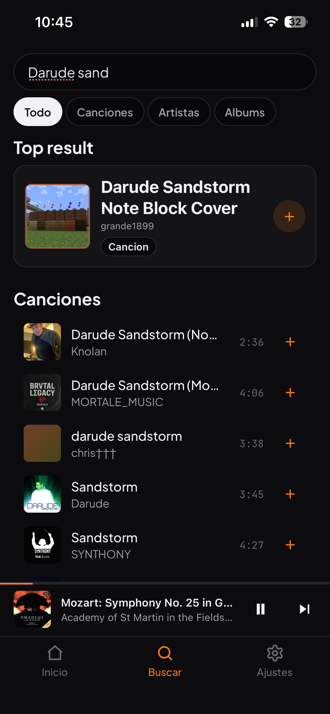
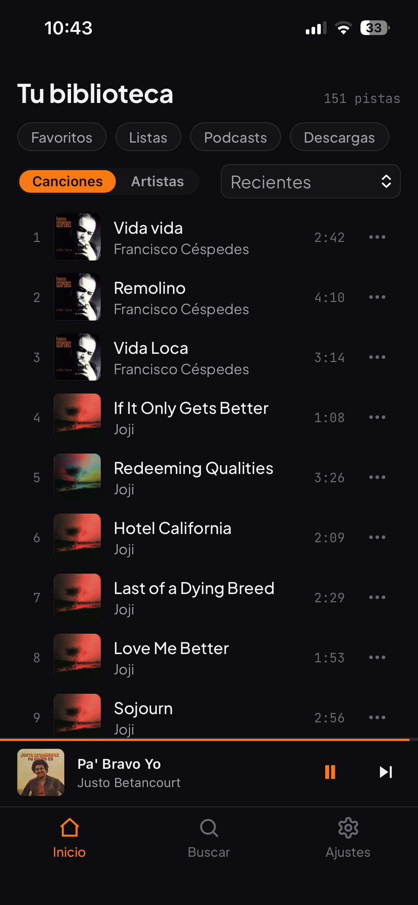
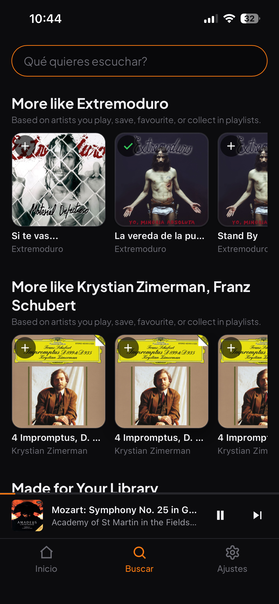
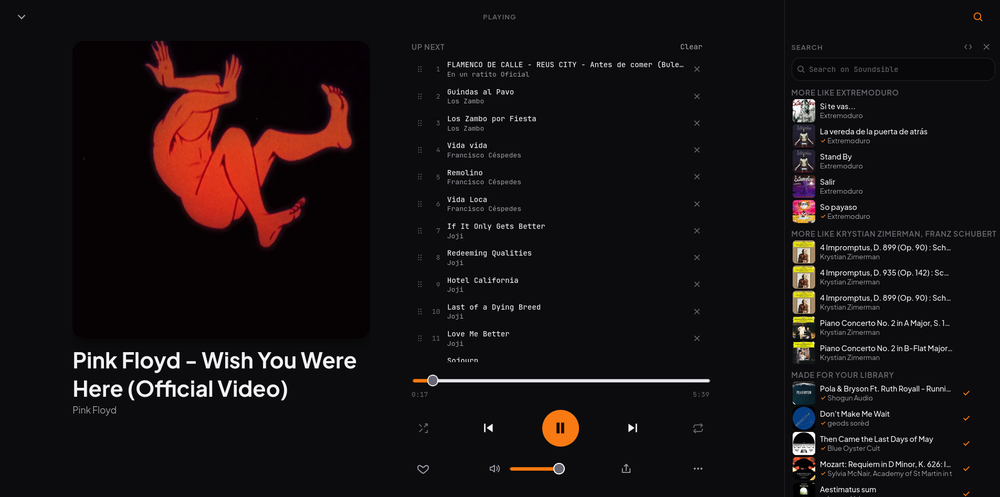

<div align="center">


# Soundsible

**Your own music streaming server. Private, free, and yours.**

[](https://arzuparreta.github.io/soundsible.github.io)
[](LICENSE)
[](https://www.python.org/)
[]()

[**Install**](#install) · [**Documentation**](#documentation) · [**Website**](https://arzuparreta.github.io/soundsible.github.io) · [**Contributing**](CONTRIBUTING.md)

</div>

---

## What is Soundsible?

Soundsible is a music app you run on your **own** machine. Browse, stream, and save music from YouTube, YouTube Music, and podcasts — in one clean player, on every device in your home. No ads, no tracking, no subscription.

| Source | What it gives you |
| ------------------- | ------------------------------------ |
| **YouTube** | A practically unlimited catalog |
| **YouTube Music** | Personalized recommendations |
| **iTunes Podcasts** | Podcasts in the same player |
| **Deezer** | Charts, discovery & clean metadata *(metadata only — no audio)* |

**What you get**

- 🎨 **Clean metadata & cover art** — accurate, not algorithmically mangled
- 🧠 **Private recommendations** built from *your own* listening history
- 📻 **Radio mode** for endless discovery without leaving your station
- 🗂️ **Everything in one place** — discover, search, podcasts, favourites, playlists, downloads
- 👥 **One server, everyone's music** — each person gets their own library, playlists and history; the files are shared, so nothing downloads twice
- 🧹 **Resilient downloads** — failed items stay visible with retry/remove, queue self-heals on restart
- 🔐 **It's your server** — your data never leaves it

> *"I built Soundsible because I'm a musician who understands how predatory music streaming has become — and a sysadmin with the tools to build a private, free alternative that doesn't sacrifice a thing."* — **Arzuparreta**

---

## Screenshots

<div align="center">

### Mobile

<p>
  
  
  
  
</p>

<sub>Search · Library · Discover · Now Playing</sub>

### Desktop


<br><sub>Library</sub>
<br><br>

<br><sub>Now Playing</sub>

</div>

---

## Install

Soundsible runs anywhere Python does. From a git clone you need **Python 3.10+**, **git**, **FFmpeg**, and **Node.js 20+** (one-time build of the SolidJS player — the production bundle is not committed to the repo). **Desktop beta** installers bundle the player, so they skip the Node.js build step.

### 👉 Pick your OS — click to expand

<details>
<summary><b>🐧 &nbsp; Linux</b></summary>
<br>

```bash
# 1. Install prerequisites (Debian / Ubuntu)
sudo apt install -y git ffmpeg python3 python3-venv python3-pip nodejs npm

# 2. Get Soundsible
git clone https://github.com/Arzuparreta/soundsible.git
cd soundsible

# 3. Install web player deps (one-time; dist builds on engine start)
cd ui_web && npm ci && cd ..
# or force a rebuild anytime: python3 scripts/ensure_ui_dist.py --force

# 4. Run it
python3 run.py
```

**Other distros** — swap step 1:

- **Arch:** `sudo pacman -S git ffmpeg python python-pip nodejs npm`
- **Fedora:** `sudo dnf install git ffmpeg python3 python3-pip nodejs npm`

</details>

<details>
<summary><b>🍎 &nbsp; macOS</b></summary>
<br>

Requires [Homebrew](https://brew.sh).

```bash
# 1. Install prerequisites
brew install git ffmpeg python node

# 2. Get Soundsible
git clone https://github.com/Arzuparreta/soundsible.git
cd soundsible

# 3. Install web player deps (one-time; dist builds on engine start)
cd ui_web && npm ci && cd ..
# or force a rebuild anytime: python3 scripts/ensure_ui_dist.py --force

# 4. Run it
python3 run.py
```

</details>

<details>
<summary><b>🪟 &nbsp; Windows</b></summary>
<br>

In **PowerShell**:

```powershell
# 1. Install prerequisites
winget install Git.Git Python.Python.3.12 Gyan.FFmpeg OpenJS.NodeJS.LTS

# 2. Close and reopen PowerShell so the new tools are on PATH, then:
git clone https://github.com/Arzuparreta/soundsible.git
cd soundsible

# 3. Install web player deps (one-time; dist builds on engine start)
cd ui_web; npm ci; cd ..

# 4. Run it
python run.py
```
No `winget`? Install [Git](https://git-scm.com/download/win), [Python](https://www.python.org/downloads/) (tick *"Add to PATH"*), [Node.js](https://nodejs.org/) (LTS), and [FFmpeg](https://ffmpeg.org/download.html) manually.

</details>

### First run

The first `python3 run.py` creates the project virtualenv, installs Python dependencies, and — if you have not configured storage yet — starts the **setup wizard** at **<http://localhost:5099/setup>** (no terminal menu yet). Complete setup in the browser, then click **Launch** on the launcher page to start the engine.

On later runs you get a terminal menu. Start listening with:

```bash
python3 run.py          # choose "Start Station Engine & Open Station"
```

That starts the engine and opens **<http://localhost:5005/player/>**. Keep the terminal open while you play; closing it stops the engine.

### Web player

The Station is one responsive **SolidJS** app served by the engine:

| URL | Use |
| --- | --- |
| **<http://localhost:5005/player/>** | Browsers, phones, PWAs — the default player |
| **<http://localhost:5005/player/desktop/>** | Same UI with owner-token bootstrap for the desktop shell |

Legacy paths (`/player/app.html`, `/player/mobile/`, …) redirect to `/player/`.

**Frontend development** — with the engine on port 5005, run `npm run dev` in `ui_web/` and open **<http://localhost:5173/player/>** (Vite proxies API and Socket.IO). See [ui_web/README.md](ui_web/README.md).

> 💡 Prefer a browser control panel over the terminal menu? Run `./venv/bin/python start_launcher.py`, open **<http://localhost:5099>**, and click **Launch**. Setup-only: `python3 run.py --setup`.

### Listen everywhere

- **On your phone (PWA)** — open the player on your phone, then *Share → Add to Home Screen* (iOS) or *Menu → Install app* (Android).
- **From anywhere** — reach your station over [Tailscale](https://tailscale.com/) at `http://<your-tailscale-ip>:5005/player/`.
- **Servers, reverse proxies, security** — see the [Install & Deployment guide](docs/INSTALL.md).

> 🖥️ **Desktop app (beta)** — a one-click Tauri app with no terminal is available for early testers. Install from [GitHub Releases](https://github.com/Arzuparreta/soundsible/releases) (tag `desktop-v*`) or build locally — see [docs/DESKTOP_BETA.md](docs/DESKTOP_BETA.md).

---

## Documentation

| Guide | What's inside |
| ----------------------------------------------------------------------- | ------------------------------------------------------------- |
| [Install & Deployment](docs/INSTALL.md) | Servers, headless/SSH, Tailscale, reverse proxy, storage, security |
| [Configuration](docs/CONFIGURATION.md) | Settings, environment variables, downloads, cookies |
| [Architecture](docs/ARCHITECTURE.md) | How Soundsible works, and how data flows |
| [Legal & Acceptable Use](docs/LEGAL.md) | Disclaimer and your responsibilities |
| [Contributing](CONTRIBUTING.md) | Dev setup and pull-request workflow |

<details>
<summary>Integrations & internals</summary>

| Document | Topic |
| ----------------------------------------------------------------------- | ------------------------------------------------------------- |
| [Agent Integration](docs/AGENT_INTEGRATION.md) | API guide for OpenClaw, Hermes, and local assistants |
| [Car Integration](docs/CAR_INTEGRATION.md) | Car media surfaces and CarPlay path |
| [Desktop (Beta)](docs/DESKTOP_BETA.md) · [Desktop Shell](desktop-shell/README.md) | Desktop app status, build, and dev workflow |
| [Telemetry & Privacy](docs/TELEMETRY_PRIVACY.md) | Local-only telemetry contract |
| [yt-dlp formats troubleshooting](docs/troubleshooting-yt-dlp-formats.md) | Fixing download format / extractor issues |
| [Appliance Rework Plan](docs/appliance-rework-plan.md) · [Premium Quality Contract](docs/PREMIUM_QUALITY_CONTRACT.md) · [Layer Contracts](docs/LAYER_CONTRACTS.md) | Roadmap & internal contracts |

</details>

---

## Legal

> **Soundsible does not encourage or support piracy or Terms-of-Service violations.** It's a neutral tool for managing and streaming your own, legally obtained media. **You alone are responsible** for how you use it and for complying with applicable laws and platform terms. Full details in [docs/LEGAL.md](docs/LEGAL.md).

---

## Built with

Soundsible stands on the shoulders of these projects. FFmpeg is system-installed; Python deps come in via `pip`; the player is built with `npm` in `ui_web/`.

| Project | License | Role |
| ------------------------------------------------------------- | ------------------ | ----------------------------------------------------------- |
| [SolidJS](https://www.solidjs.com/) + [Vite](https://vite.dev/) | MIT | Responsive Station web player (`ui_web/`) |
| [Flask](https://flask.palletsprojects.com/) + [Socket.IO](https://socket.io/) | BSD / MIT | Station Engine API and real-time events |
| [yt-dlp](https://github.com/yt-dlp/yt-dlp) | Unlicense (PD) | YouTube / YouTube Music download & search |
| [Deezer public API](https://developers.deezer.com/) | Public API | Discovery metadata only (no audio streamed from Deezer) |
| [FFmpeg](https://ffmpeg.org/) | LGPL / GPL | Audio conversion & extraction |
| [ffmpeg-python](https://github.com/kkroening/ffmpeg-python) | Apache 2.0 | Python bindings for FFmpeg |

---

## Contributing

Bug reports, ideas, and pull requests are all welcome. See [CONTRIBUTING.md](CONTRIBUTING.md) for setup, or open an [issue](https://github.com/Arzuparreta/soundsible/issues).

## License

Released under the **MIT License** — see [LICENSE](LICENSE).

---

<div align="center">

Built in public by **Arzuparreta** — musician & Linux sysadmin.

⭐ **Star the repo** &nbsp;·&nbsp; 🤝 **Contribute** &nbsp;·&nbsp; 👤 **Follow along**

[](https://github.com/Arzuparreta)
[](https://twitter.com/Arzuparreta)
[](https://linkedin.com/in/Arzuparreta)

</div>
