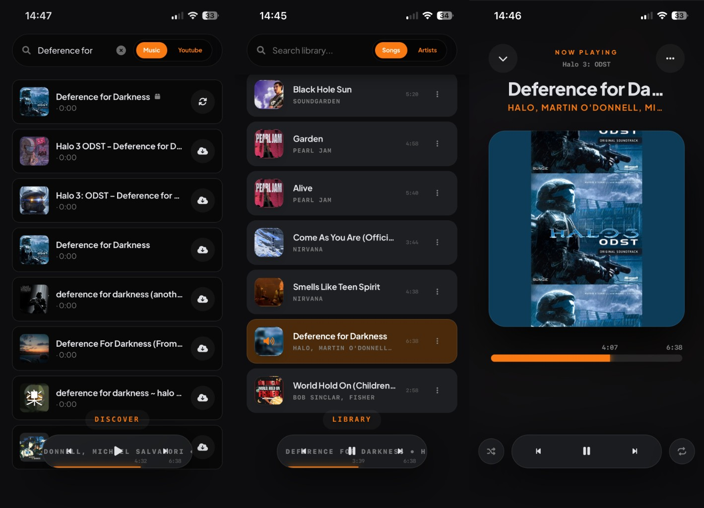

#  **Soundsible**

**Self-hosted, full‑featured music environment with a premium, across-device experience.**

Soundsible replicates how a high‑end streaming platform works, but for your **own music**.
- **Search** your music in YouTube Music / Youtube.
- **Download** and **automatically upload it** to your library with professional metadata.
- **Manage** and **listen** it from any device (streamed from your main machine).
- Queue & playback sync across devices & sessions.
- Discover/Explore music with **recommendations** from your library via YouTube (related/mix).

---

## Legal disclaimer

> [!WARNING]
> **Soundsible does not encourage or support piracy or Terms‑of‑Service violations.**  
> It is a neutral tool for managing and streaming your own, legally obtained media; **you are solely responsible** for how you use it and for complying with all applicable laws and platform terms.  
> See [docs/LEGAL.md](docs/LEGAL.md) for full legal and acceptable‑use details.

---

## Contents

- [What is Soundsible?](#what-is-soundsible)
- [Features](#features)
- [Quick start](#quick-start)
- [Installation (detailed)](#installation-detailed)
- [Getting started](#getting-started)
- [Platforms & clients](#platforms--clients)
- [Technical details & architecture](#technical-details--architecture)
- [Documentation](#documentation)
- [Third‑party components](#third-party-components)
- [Contributing](#contributing)
- [License](#license)

---

## What is Soundsible?

Soundsible is a **self‑hosted music environment** that aims to get you as close as possible to a modern streaming experience, while keeping you in full control of your files and infrastructure.

There are two typical ways to run it:

- **Full environment (recommended)**: run Soundsible on a machine reachable via [Tailscale](https://github.com/tailscale/tailscale) so you can access it from anywhere in the world.
- **Local‑only playback**: run it on a single machine and enjoy your local music with no extra networking configuration.

This repository contains the full Soundsible ecosystem, with the **Station** as its primary interface.

---

## Features

### Listening & library

- **Unified search**: Search your **library** and the **internet** from the same UI.
- **High‑quality playback**: Engine focused on **maximum audio quality**.
- **Smart library management**: Edit metadata, change covers, and manage your collection directly from the UI.
- **Universal sync**: Your playlists, favorites, metadata, and settings stay in sync across devices.

<p align="center">
  
</p>

### Discovery & downloading

- **Built‑in downloader (ODST)**: Download music from YouTube or YouTube Music from inside the app. This essentially does [yt-dlp](https://github.com/yt-dlp/yt-dlp), fills the not provided metadata, normalises everything, and uploads it to your library & db (for content you have the rights to access). This pipe is also used for the search engine & preview playback without download.
- **Configurable sources**: Choose between YouTube Music / YouTube as the search & download source.
- **Lossless‑first**: Downloader defaults to **lossless** where possible. It's configurable in settings.

<p align="center">
  
</p>

### Storage & sync

- **Flexible storage**: Store files on local disk, NAS, or supported object storage.
- **Cloud backends**: Setup wizard includes options for Cloudflare R2, Backblaze B2/R2, and S2.

---

## Quick start

**Requirements**

- Python **3.10+**
- `git`
- **FFmpeg** (installed via your OS package manager; required for downloading and audio conversion). Examples: `sudo apt install ffmpeg` (Debian/Ubuntu), `sudo pacman -S ffmpeg` (Arch), `brew install ffmpeg` (macOS). See [docs/INSTALL.md](docs/INSTALL.md) for more.
- On Linux: `python3-venv`, `python3-pip` (package names may vary slightly by distro)

```bash
git clone https://github.com/Arzuparreta/soundsible.git
cd soundsible
python3 -m venv venv
./venv/bin/pip install -r requirements.txt

# Launch the ecosystem (backend + Station)
./venv/bin/python start_launcher.py
```

Then open your browser at `http://localhost:5099` and click **Launch Ecosystem**.  
Keep that terminal open while you use Soundsible.

On Windows, replace `./venv/bin/python` with `venv\Scripts\python.exe` and `./venv/bin/pip` with `venv\Scripts\pip.exe`.

---

## Installation (detailed)

1. **Clone the repo**

   ```bash
   git clone https://github.com/Arzuparreta/soundsible.git
   cd soundsible
   ```

2. **Create a virtual environment**

   ```bash
   python3 -m venv venv
   ```

   If `python3` is not available, install Python 3 from [python.org](https://www.python.org/downloads/) or via your package manager, for example:

   ```bash
   sudo apt install python3 python3-venv
   ```

3. **Install dependencies**

   ```bash
   ./venv/bin/pip install -r requirements.txt
   ```

   On Windows:

   ```powershell
   venv\Scripts\pip.exe install -r requirements.txt
   ```

For advanced deployment topics (headless server, Tailscale, reverse proxy, storage backends), see [docs/INSTALL.md](docs/INSTALL.md).

---

## Getting started

After [installation](#installation-detailed), there are two main ways to run Soundsible.

### 1. Launcher (recommended)

From the project root:

```bash
python start_launcher.py
```

- The launcher runs at **http://localhost:5099**.
- Click **Launch Ecosystem** to start the Station Engine and open the Station.
- **Keep the launcher terminal open** — closing it will stop the Station Engine.
- Use the **Stop** button on the launcher page to stop the Station Engine cleanly.

### 2. CLI / SSH

From the project root:

```bash
python run.py
```

- Choose **Start Station Engine & Open Station**.
- Keep this terminal open while the Station Engine is running.
- Open **http://localhost:5005/player/** (or your server’s LAN IP) in your browser.
- If you use [Tailscale](https://github.com/tailscale/tailscale), open **http://[your-tailscale-ip]:5005/player/** for remote access.

The player automatically adapts to desktop or mobile layouts.

### Install as a web app

For the full immersive experience:

- **iOS / Safari**: Share → **Add to Home Screen**
- **Android / Chrome**: Menu → **Install app**

---

## Documentation

Additional documentation lives under `docs/`:

- [docs/INSTALL.md](docs/INSTALL.md) – advanced installation and deployment.
- [docs/ARCHITECTURE.md](docs/ARCHITECTURE.md) – technical architecture and data flow.
- [docs/CONFIGURATION.md](docs/CONFIGURATION.md) – configuration, environment variables, and storage backends.
- [docs/LEGAL.md](docs/LEGAL.md) – legal disclaimer and acceptable‑use notes.

Internal and troubleshooting docs:

- [docs/yt-dlp-format-errors-log.md](docs/yt-dlp-format-errors-log.md)

---

## Third‑party components

Soundsible relies on the following; They are not bundled but indeed installed automatically for users.

- **[yt-dlp](https://github.com/yt-dlp/yt-dlp)** – Unlicense (public domain). YouTube/YT Music download and search.
- **[FFmpeg](https://ffmpeg.org/)** – LGPL/GPL. Audio conversion and extraction; install via your OS.
- **[ffmpeg-python](https://github.com/kkroening/ffmpeg-python)** – Apache 2.0. Python bindings for FFmpeg (installed via `pip`).

---

## Contributing

Contributions, bug reports, and feature requests are very welcome.

- Check [CONTRIBUTING.md](CONTRIBUTING.md) for development setup and guidelines.
- Open an issue if you hit a bug or have a proposal.
- Submit a pull request for fixes or new features — even small improvements help.

---

## License

Soundsible is released under the **MIT License**.  
See [LICENSE](LICENSE) for the full text.
