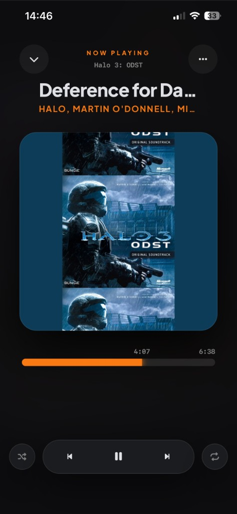
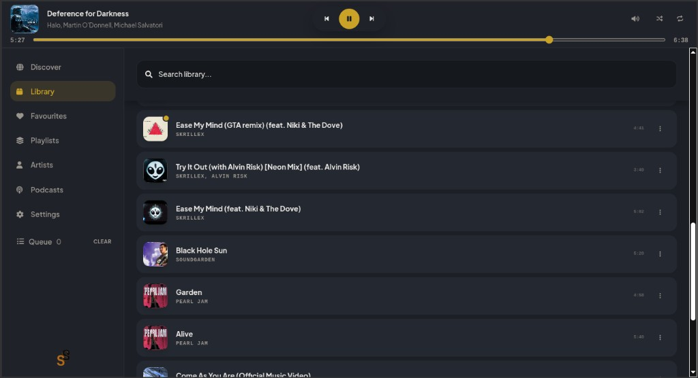
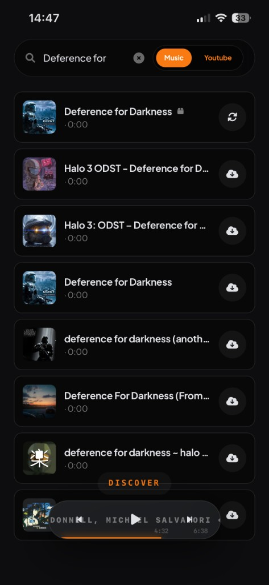
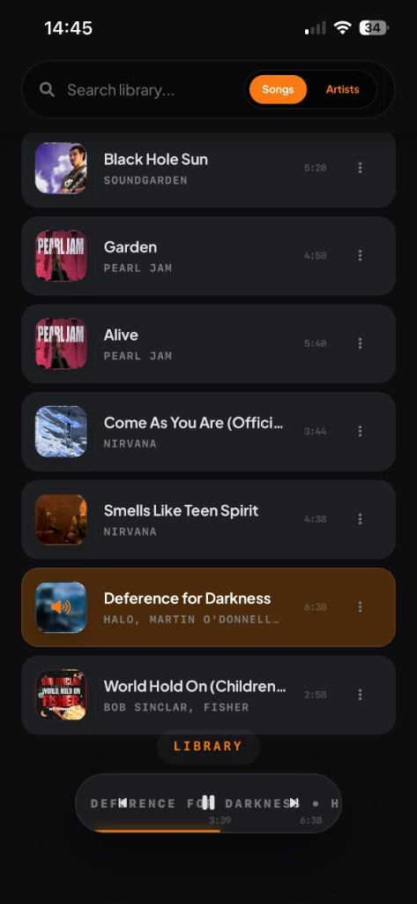

#  **Soundsible**

**Self-hosted, full‑featured music environment with a premium, mobile‑first experience.**

Soundsible replicates how a high‑end streaming platform works, but for your **own music**. It lets you **download**, **manage**, and **listen** to a self‑hosted library from anywhere, with optional access over [Tailscale](https://github.com/tailscale/tailscale).

<p align="center">
  
</p>

---

## Contents

- [What is Soundsible?](#what-is-soundsible)
- [Features](#features)
- [Quick start](#quick-start)
- [Installation (detailed)](#installation-detailed)
- [Getting started](#getting-started)
- [Platforms & clients](#platforms--clients)
- [Technical details & architecture](#technical-details--architecture)
- [Documentation](#documentation)
- [Contributing](#contributing)
- [License](#license)

---

## What is Soundsible?

Soundsible is a **self‑hosted music environment** that aims to get you as close as possible to a modern streaming experience, while keeping you in full control of your files and infrastructure.

There are two typical ways to run it:

- **Full environment (recommended)**: run Soundsible on a machine reachable via [Tailscale](https://github.com/tailscale/tailscale) so you can access it from anywhere in the world.
- **Local‑only playback**: run it on a single machine and enjoy your local music with no extra networking configuration.

This repository contains the full Soundsible ecosystem, with the **Station** as its primary interface.

---

## Features

### Listening & library

- **Unified search**: Search your **library** and the **internet** from the same search bar.
- **High‑quality playback**: Engine focused on **maximum audio quality**.
- **Smart library management**: Edit metadata, change covers, and manage your collection directly from the Station UI.
- **Universal sync**: Your playlists, favorites, metadata, and settings stay in sync across devices.

<p align="center">
  
</p>

### Discovery & downloading

- **Built‑in downloader (ODST)**: Download music from YouTube or YouTube Music from inside the app.
- **Configurable sources**: Choose between YouTube Music / YouTube as the search & download source.
- **Rich metadata**: Automatically fetches tags and artwork, with fallbacks for non‑music tracks.
- **Lossless‑first**: Downloader defaults to **lossless** where possible, with manual quality selection.

<p align="center">
  
  
</p>

### Storage & sync

- **Flexible storage**: Store files on local disk, NAS, or supported object storage.
- **Cloud backends**: Setup wizard includes options for Cloudflare R2, Backblaze B2/R2, and S2.
- **High‑grade cover fetching**: Prioritises high‑quality artwork with sensible fallbacks.

---

## Quick start

**Requirements**

- Python **3.10+**
- `git`
- On Linux: `python3-venv`, `python3-pip` (package names may vary slightly by distro)

```bash
git clone https://github.com/Arzuparreta/soundsible.git
cd soundsible
python3 -m venv venv
./venv/bin/pip install -r requirements.txt

# Launch the ecosystem (backend + Station)
./venv/bin/python start_launcher.py
```

Then open your browser at `http://localhost:5099` and click **Launch Ecosystem**.  
Keep that terminal open while you use Soundsible.

On Windows, replace `./venv/bin/python` with `venv\Scripts\python.exe` and `./venv/bin/pip` with `venv\Scripts\pip.exe`.

---

## Installation (detailed)

1. **Clone the repo**

   ```bash
   git clone https://github.com/Arzuparreta/soundsible.git
   cd soundsible
   ```

2. **Create a virtual environment**

   ```bash
   python3 -m venv venv
   ```

   If `python3` is not available, install Python 3 from [python.org](https://www.python.org/downloads/) or via your package manager, for example:

   ```bash
   sudo apt install python3 python3-venv
   ```

3. **Install dependencies**

   ```bash
   ./venv/bin/pip install -r requirements.txt
   ```

   On Windows:

   ```powershell
   venv\Scripts\pip.exe install -r requirements.txt
   ```

For advanced deployment topics (headless server, Tailscale, reverse proxy, storage backends), see [docs/INSTALL.md](docs/INSTALL.md).

---

## Getting started

After [installation](#installation-detailed), there are two main ways to run Soundsible.

### 1. Launcher (recommended)

From the project root:

```bash
python start_launcher.py
```

- The launcher runs at **http://localhost:5099**.
- Click **Launch Ecosystem** to start the Station Engine and open the Station.
- **Keep the launcher terminal open** — closing it will stop the Station Engine.
- Use the **Stop** button on the launcher page to stop the Station Engine cleanly.

### 2. CLI / SSH

From the project root:

```bash
python run.py
```

- Choose **Start Station Engine & Open Station**.
- Keep this terminal open while the Station Engine is running.
- Open **http://localhost:5005/player/** (or your server’s LAN IP) in your browser.
- If you use [Tailscale](https://github.com/tailscale/tailscale), open **http://[your-tailscale-ip]:5005/player/** for remote access.

The player automatically adapts to desktop or mobile layouts.

### Install as a web app

For the full immersive experience:

- **iOS / Safari**: Share → **Add to Home Screen**
- **Android / Chrome**: Menu → **Install app**

---

## Platforms & clients

### Station (primary interface)

The **Station** is the main interface for Soundsible on **Windows, Linux, Android, and iOS**. It is a modern web UI backed by the Station Engine, and is what you get when you open the `/player/` URL or use the launcher.

It provides:

- Full playback experience (queue, now playing, progress, volume, shuffle/repeat).
- Library browsing and editing.
- Discovery and downloading via the embedded ODST downloader.
- Guided setup to help you configure storage and services.

### Legacy desktop client (GTK, Linux)

For low‑end or resource‑constrained devices (e.g. Raspberry Pi, thin clients, older Linux boxes), there is a lightweight GTK desktop client:

```bash
./gui.sh
```

On first run, this script creates a virtual environment and installs dependencies.  
You may need additional system packages (GTK, mpv, LibAdwaita) depending on your distro.

The GTK client focuses on core playback and may lag behind the Station web UI in features and UX.

---

## Technical details & architecture

- **Backend**: Python / Flask (metadata, indexing, audio streaming).
- **Database**: SQLite (library metadata in `library.db`, FTS5 full‑text search, cache index for playback).
- **Frontend**: Vanilla JS + Tailwind CSS (zero‑dependency, high‑performance).
- **Storage**: Local filesystem plus optional cloud backends (Backblaze B2 / Cloudflare R2 / S2).

For a deeper architecture overview (components, data flow, and storage layout), see [docs/ARCHITECTURE.md](docs/ARCHITECTURE.md).

---

## Documentation

Additional documentation lives under `docs/`:

- [docs/INSTALL.md](docs/INSTALL.md) – advanced installation and deployment.
- [docs/ARCHITECTURE.md](docs/ARCHITECTURE.md) – technical architecture and data flow.
- [docs/CONFIGURATION.md](docs/CONFIGURATION.md) – configuration, environment variables, and storage backends.

Internal and troubleshooting docs:

- [docs/yt-dlp-format-errors-log.md](docs/yt-dlp-format-errors-log.md)
- [docs/discover-design-refs.md](docs/discover-design-refs.md)

---

## Contributing

Contributions, bug reports, and feature requests are very welcome.

- Check [CONTRIBUTING.md](CONTRIBUTING.md) for development setup and guidelines.
- Open an issue if you hit a bug or have a proposal.
- Submit a pull request for fixes or new features — even small improvements help.

---

## License

Soundsible is released under the **MIT License**.  
See [LICENSE](LICENSE) for the full text.
