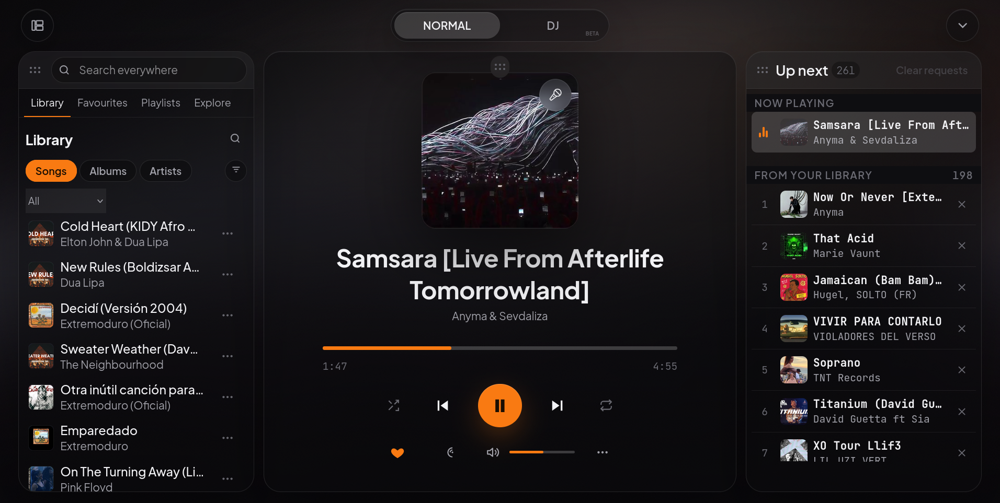
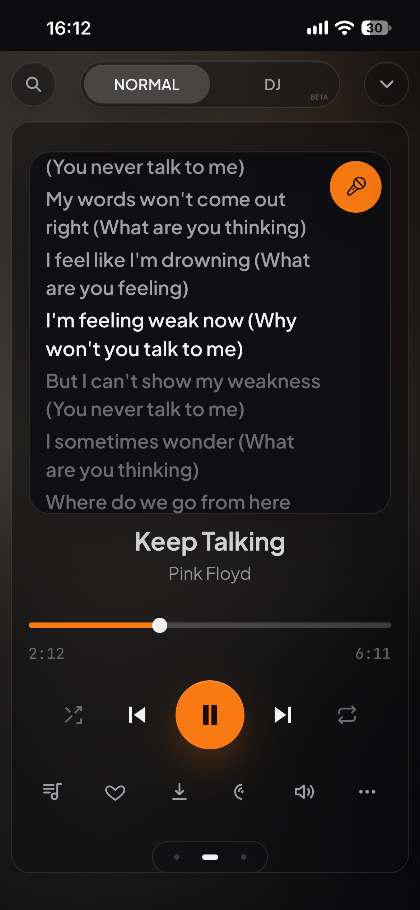
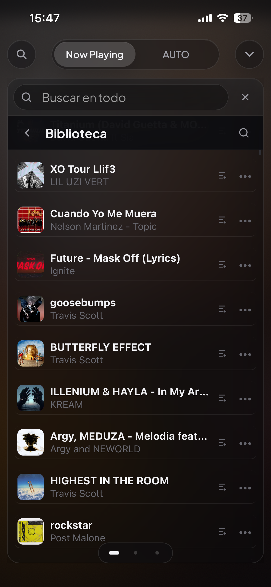
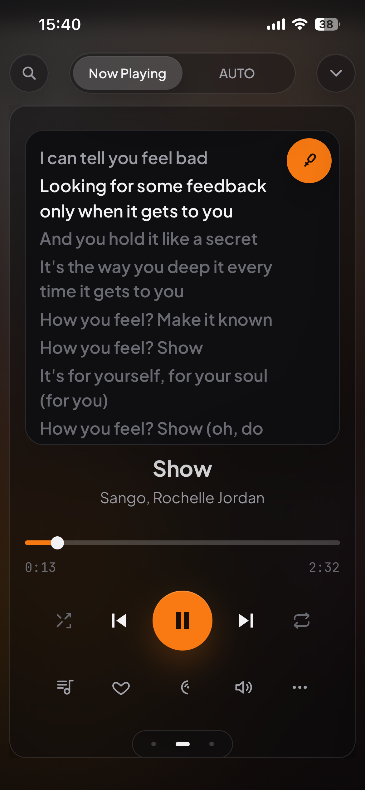

<div align="center">


# Soundsible

**Your own music streaming server. Private, free, and yours.**

[](https://arzuparreta.github.io/soundsible.github.io)
[](LICENSE)
[](https://www.python.org/)
[]()

[**Install**](#install) · [**Documentation**](#documentation) · [**Website**](https://arzuparreta.github.io/soundsible.github.io) · [**Contributing**](CONTRIBUTING.md)

</div>

---

## What is Soundsible?

Soundsible is a music app you run on your **own** machine. Browse, stream, and save music from YouTube, YouTube Music, and podcasts — in one clean player, on every device in your home. No ads, no tracking, no subscription.

| Source | What it gives you |
| ------------------- | ------------------------------------ |
| **YouTube** | A practically unlimited catalog |
| **YouTube Music** | Personalized recommendations |
| **iTunes Podcasts** | Podcasts in the same player |
| **Deezer** | Charts, discovery & clean metadata *(metadata only — no audio)* |

**What you get**

- 🔐 **Your own private music service** — self-hosted, free, with no ads, tracking, or subscription
- 🌍 **A huge catalog that becomes your library** — find music through YouTube and YouTube Music, then save it alongside the music you already own
- 🧠 **Personal discovery without giving up your profile** — recommendations and endless radio learn from your listening history on your own server
- 🎤 **Synced lyrics while you listen** — follow songs line by line on mobile or desktop
- 📱 **One polished player everywhere** — your library, playlists, favourites, podcasts, and playback follow you across devices

> *"I built Soundsible because I'm a musician who understands how predatory music streaming has become — and a sysadmin with the tools to build a private, free alternative that doesn't sacrifice a thing."* — **Arzuparreta**

---

## Screenshots

<div align="center">
  
  <br>
  
  
  
</div>

---

## Install

Choose one installation path:

- **Native installation** — run directly on Linux, macOS, or Windows, with full
  access to the launcher and the local development workflow. This is the
  primary installation method and the one the maintainer runs and maintains.
- **Docker** — one command, nothing to compile, and the practical option on a
  NAS or a Raspberry Pi. Supported, but not the primary path.
- **Desktop app (beta)** — a one-click app for Linux and Windows with no
  terminal, for a single machine rather than a server.

### Native installation

Native installs require **Python 3.10+**, **git**, **FFmpeg**, and **Node.js
22+**. Node is used for the one-time SolidJS player build; the production
bundle is not committed to the repo. **Desktop beta** installers bundle the
player, so they skip the Node.js build step.

#### Pick your OS

<details>
<summary><b>🐧 &nbsp; Linux</b></summary>
<br>

```bash
# 1. Install prerequisites (Debian / Ubuntu)
sudo apt install -y git ffmpeg python3 python3-venv python3-pip nodejs npm

# 2. Get Soundsible
git clone https://github.com/Arzuparreta/soundsible.git
cd soundsible

# 3. Install web player deps (one-time; dist builds on engine start)
cd ui_web && npm ci && cd ..
# or force a rebuild anytime: python3 scripts/ensure_ui_dist.py --force

# 4. Run it
python3 run.py
```

**Other distros** — swap step 1:

- **Arch:** `sudo pacman -S git ffmpeg python python-pip nodejs npm`
- **Fedora:** `sudo dnf install git ffmpeg python3 python3-pip nodejs npm`

</details>

<details>
<summary><b>🍎 &nbsp; macOS</b></summary>
<br>

Requires [Homebrew](https://brew.sh).

```bash
# 1. Install prerequisites
brew install git ffmpeg python node

# 2. Get Soundsible
git clone https://github.com/Arzuparreta/soundsible.git
cd soundsible

# 3. Install web player deps (one-time; dist builds on engine start)
cd ui_web && npm ci && cd ..
# or force a rebuild anytime: python3 scripts/ensure_ui_dist.py --force

# 4. Run it
python3 run.py
```

</details>

<details>
<summary><b>🪟 &nbsp; Windows</b></summary>
<br>

In **PowerShell**:

```powershell
# 1. Install prerequisites
winget install Git.Git Python.Python.3.12 Gyan.FFmpeg OpenJS.NodeJS.LTS

# 2. Close and reopen PowerShell so the new tools are on PATH, then:
git clone https://github.com/Arzuparreta/soundsible.git
cd soundsible

# 3. Install web player deps (one-time; dist builds on engine start)
cd ui_web; npm ci; cd ..

# 4. Run it
python run.py
```
No `winget`? Install [Git](https://git-scm.com/download/win), [Python](https://www.python.org/downloads/) (tick *"Add to PATH"*), [Node.js](https://nodejs.org/) (LTS), and [FFmpeg](https://ffmpeg.org/download.html) manually.

</details>

#### First native run

The first `python3 run.py` creates the project virtualenv, installs Python dependencies, and — if you have not configured storage yet — starts the **setup wizard** at **<http://localhost:5099/setup>** (no terminal menu yet). Complete setup in the browser, then click **Launch** on the launcher page to start the engine.

On later runs you get a terminal menu. Start listening with:

```bash
python3 run.py          # choose "Start Station Engine & Open Station"
```

That starts the engine and opens **<http://localhost:5005/player/>**. Keep the terminal open while you play; closing it stops the engine.

### Docker

Published for `linux/amd64` and `linux/arm64`, with FFmpeg, Chromaprint, Python
and the compiled web player already inside:

```bash
curl -O https://raw.githubusercontent.com/Arzuparreta/soundsible/main/compose.yaml
docker compose up -d
```

Wait for `soundsible` to report `healthy`, then open
**<http://localhost:5005/player/>**. The first start creates a local-storage
configuration by itself. Configuration, application data, cache, logs, and
downloaded music live in separate named volumes and survive image or container
replacement.

```bash
docker compose logs -f soundsible # follow startup/runtime logs
docker compose pull && docker compose up -d   # upgrade
docker compose down               # stop without deleting your library
```

`:edge` tracks `main`; `:latest` and `:X.Y.Z` track releases. See
[Docker deployment](docs/DOCKER.md) for host-library mounts, `.env`
configuration, provenance verification, security, backups, and building from
source instead.

### Web player

The Station is one responsive **SolidJS** app served by the engine:

| URL | Use |
| --- | --- |
| **<http://localhost:5005/player/>** | Browsers, phones, PWAs — the default player |
| **<http://localhost:5005/player/desktop/>** | Same UI with owner-token bootstrap for the desktop shell |

Legacy paths (`/player/app.html`, `/player/mobile/`, …) redirect to `/player/`.

**Frontend development** — with the engine on port 5005, run `npm run dev` in `ui_web/` and open **<http://localhost:5173/player/>** (Vite proxies API and Socket.IO). See [ui_web/README.md](ui_web/README.md).

> 💡 Prefer a browser control panel over the terminal menu? Run `./venv/bin/python start_launcher.py`, open **<http://localhost:5099>**, and click **Launch**. Setup-only: `python3 run.py --setup`.

### Listen everywhere

- **On your phone (PWA)** — open the player on your phone, then *Share → Add to Home Screen* (iOS) or *Menu → Install app* (Android).
- **From anywhere** — publish the station with `tailscale serve --bg --yes --https=443 5005`
  and open the HTTPS `.ts.net/player/` URL it prints. HTTPS also enables Live
  broadcasting from remote browsers. Already publishing something else from that
  machine? Pick another port — see
  [sharing the node](docs/INSTALL.md#sharing-the-node-with-other-services).
- **Servers, reverse proxies, security** — see the [Install & Deployment guide](docs/INSTALL.md).

> 🖥️ **Desktop app (beta)** — a one-click Tauri app with no terminal is available for early testers. Install from [GitHub Releases](https://github.com/Arzuparreta/soundsible/releases) — every release carries the installers alongside the server images — or build locally — see [docs/DESKTOP_BETA.md](docs/DESKTOP_BETA.md).

---

## Documentation

| Guide | What's inside |
| ----------------------------------------------------------------------- | ------------------------------------------------------------- |
| [Roadmap](docs/ROADMAP.md) | What Soundsible is, where it is going, and what it will not do |
| [Install & Deployment](docs/INSTALL.md) | Servers, headless/SSH, Tailscale, reverse proxy, storage, security |
| [Docker deployment](docs/DOCKER.md) | Compose, volumes, host libraries, backups, upgrades, security |
| [Configuration](docs/CONFIGURATION.md) | Settings, environment variables, downloads, cookies |
| [Architecture](docs/ARCHITECTURE.md) | How Soundsible works, and how data flows |
| [Live](docs/LIVE.md) | Broadcasting your station, sharing a room, and checking that it sounds |
| [Legal & Acceptable Use](docs/LEGAL.md) | Disclaimer and your responsibilities |
| [Contributing](CONTRIBUTING.md) | Dev setup and pull-request workflow |
| [Versioning & releases](docs/RELEASING.md) | What a version number promises, and how one is cut |

<details>
<summary>Integrations & internals</summary>

| Document | Topic |
| ----------------------------------------------------------------------- | ------------------------------------------------------------- |
| [Agent Integration](docs/AGENT_INTEGRATION.md) | API guide for OpenClaw, Hermes, and local assistants |
| [Car Integration](docs/CAR_INTEGRATION.md) | Car media surfaces and CarPlay path |
| [Desktop (Beta)](docs/DESKTOP_BETA.md) · [Desktop Shell](desktop-shell/README.md) | Desktop app status, build, and dev workflow |
| [Telemetry & Privacy](docs/TELEMETRY_PRIVACY.md) | Local-only telemetry contract |
| [yt-dlp formats troubleshooting](docs/troubleshooting-yt-dlp-formats.md) | Fixing download format / extractor issues |

Working notes that go stale and are not maintained for readers — the
[Roadmap](docs/ROADMAP.md) is the one to read instead:
[Appliance Rework Plan](docs/appliance-rework-plan.md) ·
[Premium Quality Contract](docs/PREMIUM_QUALITY_CONTRACT.md) ·
[Layer Contracts](docs/LAYER_CONTRACTS.md) ·
[UI Rebuild Plan](docs/UI_REBUILD_PLAN.md)

</details>

---

## Legal

> **Soundsible does not encourage or support piracy or Terms-of-Service violations.** It's a neutral tool for managing and streaming your own, legally obtained media. **You alone are responsible** for how you use it and for complying with applicable laws and platform terms. Full details in [docs/LEGAL.md](docs/LEGAL.md).

---

## Built with

Soundsible stands on the shoulders of these projects. FFmpeg is system-installed; Python deps come in via `pip`; the player is built with `npm` in `ui_web/`.

| Project | License | Role |
| ------------------------------------------------------------- | ------------------ | ----------------------------------------------------------- |
| [SolidJS](https://www.solidjs.com/) + [Vite](https://vite.dev/) | MIT | Responsive Station web player (`ui_web/`) |
| [Flask](https://flask.palletsprojects.com/) + [Socket.IO](https://socket.io/) | BSD / MIT | Station Engine API and real-time events |
| [yt-dlp](https://github.com/yt-dlp/yt-dlp) | Unlicense (PD) | YouTube / YouTube Music download & search |
| [Deezer public API](https://developers.deezer.com/) | Public API | Discovery metadata only (no audio streamed from Deezer) |
| [FFmpeg](https://ffmpeg.org/) | LGPL / GPL | Audio conversion & extraction |
| [ffmpeg-python](https://github.com/kkroening/ffmpeg-python) | Apache 2.0 | Python bindings for FFmpeg |

---

## Contributing

Bug reports, ideas, and pull requests are all welcome. See [CONTRIBUTING.md](CONTRIBUTING.md) for setup, or open an [issue](https://github.com/Arzuparreta/soundsible/issues).

## License

Released under the **MIT License** — see [LICENSE](LICENSE).

---

<div align="center">

Built in public by **Arzuparreta** — musician & Linux sysadmin.

⭐ **Star the repo** &nbsp;·&nbsp; 🤝 **Contribute** &nbsp;·&nbsp; 👤 **Follow along**

[](https://github.com/Arzuparreta)
[](https://twitter.com/Arzuparreta)
[](https://linkedin.com/in/Arzuparreta)

</div>
