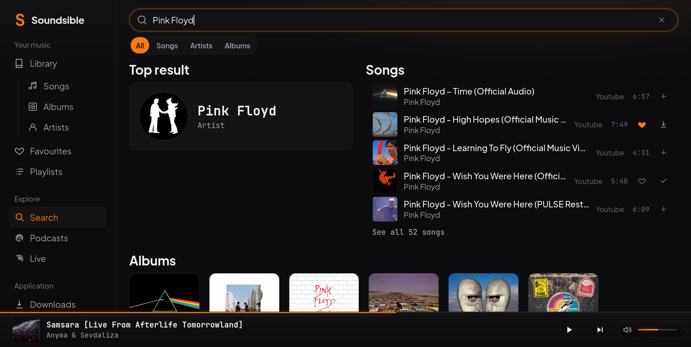
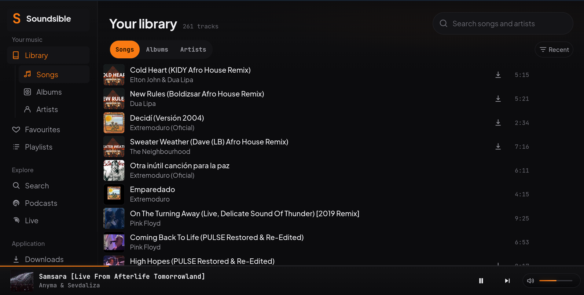
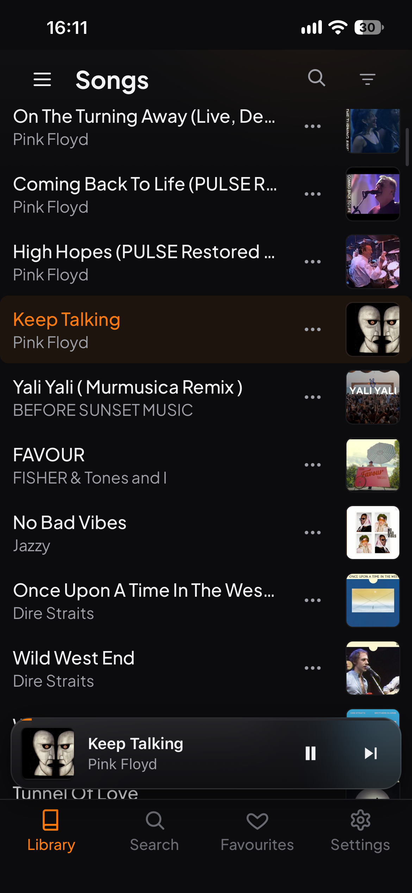

# Soundsible

**Find your next favourite. Make it part of your collection.**

A music service on your own server, with YouTube search, a built-in DJ and live broadcasting.
Free and open source. No ads or subscription.

[**Get started**](#install) · [**Features**](#features) · [**Docs**](docs/https://arzuparreta.github.io/soundsible.github.io/docs/native-installation/) · [**Website**](https://arzuparreta.github.io/soundsible.github.io)

## What Soundsible does

**Search the whole internet.** Listen, save, download and manage everything in one place.

**Enjoy endless playback, infinite autoplay, radio mode, and auto DJ sessions.** Choose where to start and soundsible builds the set. DJ mode analyses tempo, key and energy to pick songs and mixes between them on two decks. You can influence, change direction or request a song on a certain spot of the route.
DJ is in beta — [what it can do →](docs/AUTO_MODE.md)

**Broadcast what you are playing.** We host a little listening room for users to stream their DJ sessions to the world!
[How Live works →](docs/LIVE.md)

## Features

What you can do

- **Search the complete Youtube Music cataloge or paste a link.** You can listen on the go, save without downloading, or download the song to the server. Availability depends on YouTube.
- **Your music**: Browse by artist, album, genre or year; make playlists and save favourites. You can also upload your own audio files.
- **Lyrics**: Real-time synced lyrics, or read plain lyrics when available.
- **Discovery**: Get recommendations from your listening history, start a Radio from a song or let Autoplay and DJ continue after your queue ends. Recommendation learning is **optional**, **private** and always stays on your server.
- **Import music**: Import Spotify or Apple Music exports. Soundsible finds matching recordings; the export itself contains no audio. [Import guide](docs/MUSIC_MIGRATION.md)
- **Podcasts**: Find podcasts, subscribe and play episodes in the same app.
- **Multi-user support**: Each person has their own library, playlists, favourites and listening history.

More screenshots: search, library and mobile lyrics

 

## Clients and devices

Open Soundsible in a desktop or mobile browser, or add it to your home screen as
an installable web app (PWA). Your server holds your collection and listening
history. [Set up access away from home →](docs/INSTALL.md#4-remote-access-over-tailscale)

The [desktop app is in beta](docs/DESKTOP_BETA.md) and can run the server on the
same computer. [OpenSubsonic](docs/OPENSUBSONIC.md) also lets compatible apps play
your saved library; external search and DJ remain in Soundsible.

Native iOS has **not been run on a device**. Its playback, offline downloads and
car controls are unverified. Broader offline and device support is on the
[roadmap](docs/ROADMAP.md); see [iOS status](docs/IOS.md) for details.

## Install

| Run it on… | Start here |
| --- | --- |
| **Your computer or server** | [Native installation](docs/INSTALL.md#2-install-on-your-computer) for Linux, macOS and Windows. This is the maintainer's primary installation method. |
| **Docker / NAS** | [Docker Compose setup](docs/DOCKER.md), with persistent storage and prebuilt images. |
| **Desktop, without a terminal** | [Download a desktop beta](https://github.com/Arzuparreta/soundsible/releases). Check the [platform status](docs/DESKTOP_BETA.md) before installing. |

For native and Docker installs, open **<http://localhost:5005/player/>** on the
server, or replace `localhost` with its address on another device. The desktop
app opens its own player.

## Documentation

[Browse all guides →](docs/README.md)

[Settings & sources](docs/CONFIGURATION.md) · [DJ](docs/AUTO_MODE.md) ·
[Live](docs/LIVE.md) · [Roadmap](docs/ROADMAP.md) ·
[Privacy](docs/TELEMETRY_PRIVACY.md)

Built by [Arzuparreta](https://github.com/Arzuparreta), a musician and sysadmin.
[Report a problem](https://github.com/Arzuparreta/soundsible/issues) or
[help build Soundsible](CONTRIBUTING.md).

[MIT licensed](LICENSE). Use music you have the right to download and share.
[Legal & acceptable use](docs/LEGAL.md).
