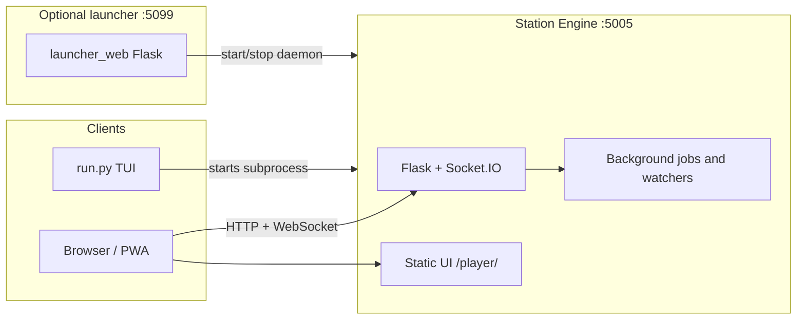

## ARCHITECTURE – System overview

This document describes how the Soundsible repository is structured, which processes run where, and how data flows between components. For deployment and networking details see [INSTALL.md](INSTALL.md); for knobs and env vars see [CONFIGURATION.md](CONFIGURATION.md).

### 1. Mental model

Soundsible is a **self-hosted music environment**: a Python **Station Engine** exposes an HTTP API and real-time events, serves the **Station** web UI, and coordinates library management, playback state, and downloads. A separate optional **web launcher** helps start the legacy daemon from a browser. Optional **CLI** flows use the same engine entry points.

At runtime you typically have one of these engine modes:

- **Legacy daemon** — one process listening on **port 5005** by default (`STATION_PORT` in `shared/constants.py`). It runs Flask, Socket.IO (async mode **gevent**), and background work (download queue, file watchers, optional library sync).
- **Desktop engine** — one process started with `run.py --desktop-engine` or `soundsible_engine.py`. It binds to **`127.0.0.1` on a random free port by default**, writes runtime state under the app config dir, and emits a single JSON readiness line on stdout before normal startup logs.
- **Web launcher** — optional Flask app on **port 5099** (`start_launcher.py` / `launcher_web/`). It does **not** serve the player; it only helps start or stop the engine and run first-time setup UI.

The **Station** UI is a responsive SolidJS application under `ui_web/`, served by the engine at **`/player/`** and **`/player/desktop/`**. Both routes use the same frontend; the desktop route additionally receives the owner-token bootstrap required by the desktop shell. The UI talks to the engine over REST and WebSocket (Socket.IO).

### 2. Repository layout (high level)

| Area | Role |
|------|------|
| `run.py` | Universal entry: venv bootstrap, optional **TUI** menu, legacy **`--daemon`**, or desktop **`--desktop-engine`**. |
| `soundsible_engine.py` | Standalone desktop engine entrypoint that wraps `run.py --desktop-engine`. |
| `shared/` | Cross-cutting code: Flask API app (`shared/api/`), models, config paths, security helpers, SQLite access, job orchestration. |
| `player/` | Library manager, queue, favourites, cache — **core playback and library** logic used by the API. |
| `ui_web/` | SolidJS + TypeScript Station frontend and Vite build; includes **Discover** (Deezer metadata + YouTube resolution). |
| `launcher_web/` | Small Flask app for the launcher pages and “launch/stop ecosystem” API. |
| `odst_tool/` | Download pipeline (yt-dlp, FFmpeg), ODST library format, cloud sync helpers; embedded in the API for downloads. |
| `setup_tool/` | Storage providers (local, S3-compatible), scanning, uploads, audio/cover helpers used by library and sync paths. |

### 3. Process and network view

- **Starting the legacy daemon**: `shared/daemon_launcher.py` spawns `venv` Python with `run.py --daemon`, which calls `shared.api.start_api()` and binds **0.0.0.0:5005**.
- **Starting the desktop engine**: `soundsible_engine.py` or `run.py --desktop-engine` builds a `RuntimeConfig`, creates a short owner token file plus matching scoped auth token, writes `desktop-engine-state.json` under the config dir, and then starts `shared.api.start_api()` on loopback.
- **CORS**: REST CORS defaults allow localhost, private LAN, and Tailscale-style ranges unless overridden by `SOUNDSIBLE_ALLOWED_ORIGINS`. Socket.IO CORS can be tightened with `SOUNDSIBLE_SOCKET_CORS_ORIGINS`.

### 4. Station Engine internals

The Flask application lives in `shared/api/__init__.py`. It:

- Registers blueprints for **library**, **playback**, **downloader**, **config**, **discovery**, **podcasts**, and **agent** (`shared/api/routes/`).
- Serves the web player under `/player/`: prefers the `ui_web/dist` build when present, falling back to the `ui_web` source tree (override with `SOUNDSIBLE_WEB_UI_DIST=0/1`).
- Holds singletons for **LibraryManager**, **QueueManager**, **FavouritesManager**, and the download subsystem.
- Uses **Socket.IO** for live updates (e.g. library changes, downloader progress, playback coordination).

**Desktop sidecar contract**:

- The desktop engine emits one newline-delimited JSON readiness event on stdout with `base_url`, `host`, `port`, `pid`, `version`, `health`, and `owner_token_file`.
- Runtime state is mirrored to `desktop-engine-state.json` in the config dir so a future desktop shell can stop only the owned process by PID instead of killing by port.
- `GET /api/health` returns runtime directories, uptime, owner token file path, library stats, and active background-job state for shell diagnostics.
- `/player/desktop/` now receives the owner token through HTML bootstrap injection (`meta` + `window.__SOUNDSIBLE_OWNER_TOKEN__`) so the desktop player can call owner-protected routes without query-string hacks.

**Pairing primitives**:

- Owners create short-lived pairing sessions with **`POST /api/pairing/sessions`** and can inspect them with **`GET /api/pairing/sessions`**.
- Session payloads now include QR-ready connection metadata: candidate LAN base URLs, claim/player URLs, and a compact JSON `qr_text` payload suitable for encoding directly into a QR code.
- Clients claim a visible pairing code through **`POST /api/pairing/sessions/claim`**.
- Owners complete or cancel the flow through **`POST /api/pairing/sessions/<id>/confirm`** and **`POST /api/pairing/sessions/<id>/cancel`**.
- The shell can explicitly mark the QR sheet open or closed through **`POST /api/pairing/sessions/<id>/display-open`** and **`POST /api/pairing/sessions/<id>/display-close`**. If `auto_confirm` is enabled while display is open, a claim can complete immediately without a second owner round-trip.
- Successful confirmation creates a scoped `paired_device` bearer token in `auth_tokens`; owners can list and revoke those tokens with **`GET /api/paired-devices`** and **`POST /api/paired-devices/<token_id>/revoke`**.
- The engine exposes this flow, but wiring it into the SolidJS Settings view remains a
  `new-ui` parity task before cutover.

**Job orchestration** (`shared/api/orchestrator.py`): a small **JobOrchestrator** serializes metadata writes and runs bounded concurrent work (e.g. downloads) so heavy tasks do not stampede the library.

**Download path**: queued items are processed in the background; completed tracks are merged into the main library metadata (`_sync_odst_to_main_core` and related helpers). FFmpeg and yt-dlp are used via `odst_tool/`.

**Library path**: `player/library.py` loads **`library.json`** (see `LIBRARY_METADATA_FILENAME`) and **`~/.config/soundsible/config.json`** for `PlayerConfig`, talks to **SQLite** (`shared/database.py`) for fast search and manifest sync, and can use **storage providers** from `setup_tool/` for cloud-backed libraries.

**Device registry and handoff**:

- Clients register with **`POST /api/devices/register`** using `device_id`, `device_name`, and `device_type` (`mobile`, `desktop`, or `agent`). The registry is process-local and scoped through the same playback scope resolver as playback state.
- Socket.IO clients still join **`playback:{scope}:{device_id}`** rooms through `playback_register`; that event also refreshes the registry for existing web clients.
- Playback state remains isolated by `scope` and `device_id`. Clients publish state with **`PUT /api/playback/state`** and stop requests use **`POST /api/playback/notify-stop`**.
- **`POST /api/playback/handoff`** reads the source device state, emits `playback_stop_requested` to `playback:{scope}:{from_device_id}`, writes the target device state with the existing playback-state helper, and emits `playback_start_requested` to `playback:{scope}:{to_device_id}`. It does not broadcast across scopes or unscoped rooms.

**Agent API**:

- Agent tokens are created with **`POST /api/agent/token`**. This route is admin-protected using the same policy as other admin routes (`SOUNDSIBLE_ADMIN_TOKEN` when configured, otherwise trusted LAN/Tailscale compatibility).
- Scoped auth tokens are stored in SQLite `auth_tokens` as hashes only. The desktop engine uses an `owner` token, and agents use scoped `agent` tokens. Legacy agent routes still preserve compatibility with the older `agent_tokens` table.
- Agents authenticate with `Authorization: Bearer <token>` or `X-Soundsible-Agent-Token`.
- **`GET /api/agent/verify`**, **`POST /api/agent/play`**, and **`POST /api/agent/command`** require `@require_agent_token`.
- Agent control targets a supplied `device_id` or the most recently registered non-agent device in the current scope. Commands emit to `playback:{scope}:{device_id}` rooms and reuse playback state for `play`/handoff-style starts.

**Discover / Deezer proxy** (`shared/api/routes/discovery.py`):

- The browser cannot call `api.deezer.com` (CORS). The Station exposes **`GET /api/discovery/deezer/<path>`**, which forwards **allowlisted** Deezer paths only (e.g. `chart`, `search`, `playlist/<id>`, `track/<id>`, `artist/<id>/top`) and returns Deezer’s JSON unchanged.
- Requests are **rate-limited** per IP (`discovery_deezer`). The engine needs **outbound HTTPS** to Deezer.
- **Discover** in `ui_web` (`discovery.js`, `deezer_actions.js`, shared list renderers) uses this for charts, curated editorial playlists, and search. Track rows use Deezer ids in the UI (`deezer_<numericId>`).
- **Playback and downloads** for those rows do **not** use Deezer audio. The UI runs **YouTube / YouTube Music text search** (same ODST `/api/downloader/youtube/search` path as the downloader) using Deezer title + artist, picks a matching video id, then:
  - **In-app preview** streams via **`GET /api/preview/stream/<video_id>`** (playback blueprint).
  - **Download queue** uses the resolved item like any other ODST search result.
- Resolution can take a few seconds; the download-queue popover may show a short **“Finding YouTube match…”** state while that search runs.

### 5. Data and configuration (conceptual)

One engine serves **several accounts**. State splits in two: what belongs to the
machine, and what belongs to a person.

**Instance-level** (one copy, admin-managed):

| Location | Purpose |
|----------|---------|
| `<config>/instance.db` | Accounts, credentials (`auth_tokens`, `agent_tokens`), pairing sessions, and the content-addressed caches everyone shares (YouTube resolution, related mixes, lyrics). |
| `<config>/config.json` | Storage backend and credentials (`PlayerConfig`). |
| `<config>/output_dir`, `<config>/music_dir.json` | Where the shared music pool lives. |
| `<config>/cookies.txt` | yt-dlp cookies. |
| `<config>/download_queue.json` | One queue; each row carries `user_id`. |
| `<music>/tracks/<hash>.<ext>` | **Shared audio pool.** The track id *is* the content hash, so two people who own the same song point at the same file — nothing is downloaded or stored twice. |
| `<music>/library.json` | Instance catalog of what is physically on disk (written by ODST). |
| `<cache>/previews/`, `<cache>/covers/` | Shared, content-addressed. |
| `<data>/telemetry/` | `setup-events`, `migration-events`. |

**Per account**, under `<config>/users/<user_id>/` and `<data>/users/<user_id>/`:

| File | Purpose |
|------|---------|
| `library.json` | *Your* library: which tracks you own, plus any metadata you edited on them. |
| `library.db` | SQLite index of that manifest. |
| `favourites.json`, `playback_state.json`, `discovery_settings.json` | Favourites, cross-device resume, discovery opt-in. |
| `queue_state.json` *(data dir)* | Playback queue. |
| `telemetry/listening-events.jsonl`, `telemetry/play-timing.jsonl` *(data dir)* | Listening history — the input to *your* recommendations. |

Editing a track's tags re-encodes the file and therefore changes its hash, which
mints a new track id. That is what keeps metadata edits private: your manifest
follows the new id while everyone else keeps the original.

Exact filenames and fields may evolve; treat the code under `shared/` and `player/` as the source of truth.

### 5A. Accounts, sessions, and the identity gate

- **Accounts** live in `shared/users.py` (policy) over the `users` table. Roles are
  `admin` and `member`. Passwords are scrypt hashes (`werkzeug.security`).
- **Sessions** are opaque 32-byte tokens stored *only as SHA-256 hashes* in
  `auth_tokens` with `kind='session'` and a `user_id`, delivered as an HttpOnly
  `sb_session` cookie. The cookie rides along with the Socket.IO handshake, so
  real-time auth is free.
- **`instance_requires_login()`** is the switch. It is `False` in exactly one
  case — a single account with no password, which is what a migrated single-user
  install looks like — and `True` from the moment a second account exists or the
  only account gets a password.
- **One gate, not 126 decorators.** `before_request` in `shared/api/__init__.py`
  resolves the caller, returns **401** for any `/api/*` outside a small public
  allowlist (`/api/auth/state`, `/api/auth/login`, `/api/auth/logout`,
  `/api/health`, `/api/pairing/sessions/claim`), and binds the user for the rest
  of the request. Managers underneath resolve their paths through that binding
  (`shared/user_context.py`), and asking for a user directory with nobody bound
  raises rather than silently falling back.
- **Scopes**: members hold `library:read`, `library:write`, `playback:control`,
  `download:add`, `admin:config` (their own preferences). Admins additionally hold
  **`admin:instance`** — music folder, storage backend, downloader tuning,
  optimization, cloud sync, and account management — plus `admin:dangerous`.
- **Real-time isolation**: each socket joins a `user:{user_id}` room;
  `library_updated` and `downloader_*` are emitted there, never broadcast.
  Playback rooms stay `playback:{scope}:{device_id}` where the scope is the user id.
- **Migration** (`shared/multiuser_migration.py`) runs on every boot and is
  idempotent. On a pre-multiuser install it creates the admin account, moves the
  flat state under `users/<id>/`, copies the instance tables out of the old
  `library.db` (so paired devices and warm caches survive), and leaves the
  originals renamed `*.singleuser.bak`.

### 6. Security notes (brief)

- **Path and network hardening** live in `shared/security.py` and `shared/hardening.py` (e.g. admin actions on the launcher, rate limits, response headers).
- Playback registration uses scoped Socket.IO rooms so stop/resume semantics stay consistent across tabs/devices where implemented.
- REST CORS is controlled by `SOUNDSIBLE_ALLOWED_ORIGINS`; include mobile app origins there when they are not covered by the default localhost/LAN/Tailscale patterns. Agent requests may use `Authorization` or `X-Soundsible-Agent-Token`, both allowed by API CORS.

### 7. Related documentation

- [INSTALL.md](INSTALL.md) — headless operation, reverse proxy, Tailscale.
- [AGENT_INTEGRATION.md](AGENT_INTEGRATION.md) — API guide for OpenClaw, Hermes agents, and local assistants.
- [CAR_INTEGRATION.md](CAR_INTEGRATION.md) — car media surfaces, `/api/car/*`, and native companion contract.
- [CONFIGURATION.md](CONFIGURATION.md) — configuration surfaces and environment variables.
- [troubleshooting-yt-dlp-formats.md](troubleshooting-yt-dlp-formats.md) — yt-dlp format issues when using cookies.
- [LEGAL.md](LEGAL.md) — acceptable use.
