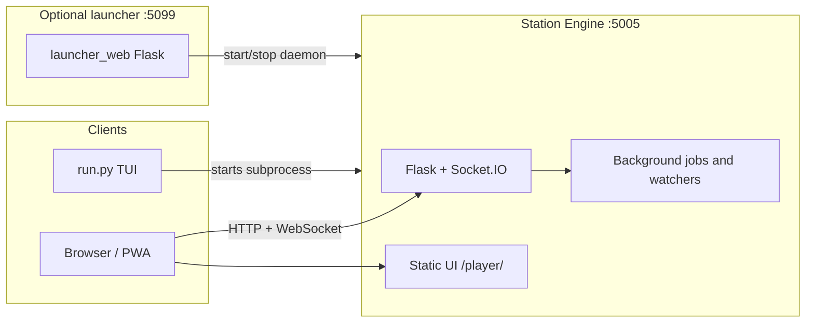

## ARCHITECTURE – System overview

This document describes how the Soundsible repository is structured, which processes run where, and how data flows between components. For deployment and networking details see [INSTALL.md](INSTALL.md); for knobs and env vars see [CONFIGURATION.md](CONFIGURATION.md).

### 1. Mental model

Soundsible is a **self-hosted music environment**: a Python **Station Engine** exposes an HTTP API and real-time events, serves the **Station** web UI, and coordinates library management, playback state, and downloads. A separate optional **web launcher** helps start the engine from a browser. Optional **CLI** flows use the same engine entry points.

At runtime you typically have:

- **Station Engine** — one process listening on **port 5005** (`STATION_PORT` in `shared/constants.py`). It runs Flask, Socket.IO (async mode **gevent**), and background work (download queue, file watchers, optional library sync).
- **Web launcher** — optional Flask app on **port 5099** (`start_launcher.py` / `launcher_web/`). It does **not** serve the player; it only helps start or stop the engine and run first-time setup UI.

The **Station** UI is static assets under `ui_web/`, served by the engine at **`/player/`** (and **`/player/desktop/`** for the desktop-oriented layout). The UI talks to the engine over REST and WebSocket (Socket.IO).

### 2. Repository layout (high level)

| Area | Role |
|------|------|
| `run.py` | Universal entry: venv bootstrap, optional **TUI** menu, or **`--daemon`** to run the Station Engine only. |
| `shared/` | Cross-cutting code: Flask API app (`shared/api/`), models, config paths, security helpers, SQLite access, job orchestration. |
| `player/` | Library manager, queue, favourites, cache — **core playback and library** logic used by the API. |
| `ui_web/` | Station front-end (HTML, JS, Tailwind/Vite build); includes **Discover** (Deezer metadata + YouTube resolution). |
| `launcher_web/` | Small Flask app for the launcher pages and “launch/stop ecosystem” API. |
| `odst_tool/` | Download pipeline (yt-dlp, FFmpeg), ODST library format, cloud sync helpers; embedded in the API for downloads. |
| `setup_tool/` | Storage providers (local, S3-compatible), scanning, uploads, audio/cover helpers used by library and sync paths. |

### 3. Process and network view

- **Starting the engine**: `shared/daemon_launcher.py` spawns `venv` Python with `run.py --daemon`, which calls `shared.api.start_api()` and binds **0.0.0.0:5005**.
- **CORS**: REST CORS defaults allow localhost, private LAN, and Tailscale-style ranges unless overridden by `SOUNDSIBLE_ALLOWED_ORIGINS`. Socket.IO CORS can be tightened with `SOUNDSIBLE_SOCKET_CORS_ORIGINS`.

### 4. Station Engine internals

The Flask application lives in `shared/api/__init__.py`. It:

- Registers blueprints for **library**, **playback**, **downloader**, **config**, and **discovery** (`shared/api/routes/`).
- Serves `ui_web` (or `ui_web/dist` when `SOUNDSIBLE_WEB_UI_DIST` is enabled) under `/player/`.
- Holds singletons for **LibraryManager**, **QueueManager**, **FavouritesManager**, and the download subsystem.
- Uses **Socket.IO** for live updates (e.g. library changes, downloader progress, playback coordination).

**Job orchestration** (`shared/api/orchestrator.py`): a small **JobOrchestrator** serializes metadata writes and runs bounded concurrent work (e.g. downloads) so heavy tasks do not stampede the library.

**Download path**: queued items are processed in the background; completed tracks are merged into the main library metadata (`_sync_odst_to_main_core` and related helpers). FFmpeg and yt-dlp are used via `odst_tool/`.

**Library path**: `player/library.py` loads **`library.json`** (see `LIBRARY_METADATA_FILENAME`) and **`~/.config/soundsible/config.json`** for `PlayerConfig`, talks to **SQLite** (`shared/database.py`) for fast search and manifest sync, and can use **storage providers** from `setup_tool/` for cloud-backed libraries.

**Discover / Deezer proxy** (`shared/api/routes/discovery.py`):

- The browser cannot call `api.deezer.com` (CORS). The Station exposes **`GET /api/discovery/deezer/<path>`**, which forwards **allowlisted** Deezer paths only (e.g. `chart`, `search`, `playlist/<id>`, `track/<id>`, `artist/<id>/top`) and returns Deezer’s JSON unchanged.
- Requests are **rate-limited** per IP (`discovery_deezer`). The engine needs **outbound HTTPS** to Deezer.
- **Discover** in `ui_web` (`discovery.js`, `deezer_actions.js`, shared list renderers) uses this for charts, curated editorial playlists, and search. Track rows use Deezer ids in the UI (`deezer_<numericId>`).
- **Playback and downloads** for those rows do **not** use Deezer audio. The UI runs **YouTube / YouTube Music text search** (same ODST `/api/downloader/youtube/search` path as the downloader) using Deezer title + artist, picks a matching video id, then:
  - **In-app preview** streams via **`GET /api/preview/stream/<video_id>`** (playback blueprint).
  - **Download queue** uses the resolved item like any other ODST search result.
- Resolution can take a few seconds; the download-queue popover may show a short **“Finding YouTube match…”** state while that search runs.

### 5. Data and configuration (conceptual)

| Location | Purpose |
|----------|---------|
| `~/.config/soundsible/config.json` | Primary user configuration (wizard / settings). |
| `~/.config/soundsible/library.json` | Library metadata manifest (tracks, playlists). |
| `~/.config/soundsible/library.db` | SQLite index for search and sync. |
| `~/.config/soundsible/output_dir` | Written by the API so all components agree on music output path. |
| `odst_tool/.env` | Optional overrides (e.g. `OUTPUT_DIR`, downloader tuning) used by ODST and API bootstrap. |

Exact filenames and fields may evolve; treat the code under `shared/` and `player/` as the source of truth.

### 6. Security notes (brief)

- **Path and network hardening** live in `shared/security.py` and `shared/hardening.py` (e.g. admin actions on the launcher, rate limits, response headers).
- Playback registration uses scoped Socket.IO rooms so stop/resume semantics stay consistent across tabs/devices where implemented.

### 7. Related documentation

- [INSTALL.md](INSTALL.md) — headless operation, reverse proxy, Tailscale.
- [CONFIGURATION.md](CONFIGURATION.md) — configuration surfaces and environment variables.
- [troubleshooting-yt-dlp-formats.md](troubleshooting-yt-dlp-formats.md) — yt-dlp format issues when using cookies.
- [LEGAL.md](LEGAL.md) — acceptable use.
