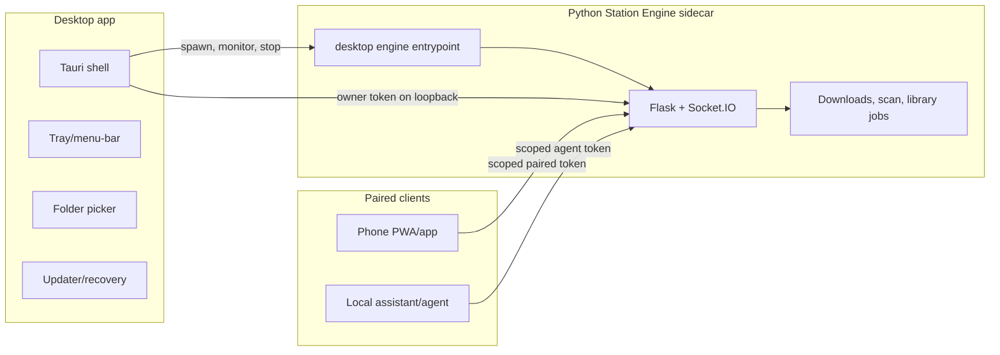

# Soundsible Appliance Rework Plan

## Decision

Build the consumer product as a desktop appliance: a Tauri shell that owns a bundled Python Station Engine sidecar, a tray/menu-bar lifecycle, local-first onboarding, QR phone pairing, and safe updates.

Do not make the normal consumer path a Windows Service or a headless Linux install. Those stay supported as Advanced mode. The default story should feel like Spotify or Discord: install, open, choose a music folder, play, pair phone, and keep running in the background for the current user.

## Product Target

The long-term product vision is "self-host your own Spotify anywhere." The first implementation target is narrower:

- A normal desktop user can run Soundsible without Python, git, FFmpeg, terminals, ports, or config files.
- The desktop app is the owner device. It starts, stops, updates, diagnoses, and repairs the Station Engine.
- Phones are paired clients in v1. They control and stream from the desktop appliance, but they do not host the engine yet.
- Server, NAS, cloud storage, reverse proxy, Tailscale, and systemd remain available under Advanced setup.
- Future mobile hosting is prepared through a host/supervisor abstraction, not built in v1.

## Current State

Soundsible already has most of the engine pieces, but they are wired for developer/headless operation:

- `run.py` bootstraps a project-local virtual environment, then runs a TUI, setup launcher, or `--daemon`.
- `shared/api/__init__.py` creates a module-level Flask/Socket.IO app and `start_api(port=STATION_PORT)` always binds `0.0.0.0`.
- `shared/daemon_launcher.py` starts `venv/bin/python run.py --daemon` on fixed port `5005` and stops it with `fuser`/`taskkill` by port ownership.
- `launcher_web/server.py` is a localhost-first setup/control UI on port `5099`.
- `shared/constants.py` still hardcodes Linux-style config/cache/data locations.
- `shared/hardening.py` treats LAN/Tailscale as admin when no admin token is configured.
- `shared/database.py` has an `agent_tokens` table, but tokens are currently agent-oriented and unscoped.
- The web UI build already supports a Vite `dist` path through `SOUNDSIBLE_WEB_UI_DIST`.

The rework should preserve these paths while adding a cleaner desktop runtime seam.

## Non-Negotiables

- Desktop mode binds the Station Engine to `127.0.0.1` on a random free port unless the user explicitly enables LAN access.
- LAN/Tailscale discovery is not authorization. Any paired device or agent must present a token.
- The desktop shell owns the engine process it starts. It must not kill arbitrary processes by port.
- Consumer setup starts with a local folder. Cloud storage and server networking are Advanced, not first-run requirements.
- The Python engine remains usable without Tauri for headless and contributor workflows.
- Dangerous actions require the local owner token plus a fresh confirmation.

## Target Architecture



### Runtime Boundaries

- `run.py` remains the compatibility bootstrap for contributors and headless users.
- Add a Python package entrypoint such as `soundsible-engine` for packaged desktop execution.
- Add an explicit desktop mode flag or command, for example `--desktop-engine`.
- Keep setup/launcher routes available for Advanced mode, but do not make the desktop shell depend on the launcher web app.
- Add a runtime config object that is passed into API startup instead of reading all behavior from constants and environment variables.

### Engine Readiness Contract

The sidecar must emit one newline-delimited JSON readiness message on stdout before regular logs:

```json
{
  "event": "ready",
  "base_url": "http://127.0.0.1:49152",
  "host": "127.0.0.1",
  "port": 49152,
  "pid": 12345,
  "version": "0.0.0-dev",
  "health": "/api/health",
  "owner_token_file": "/path/to/runtime/owner-token"
}
```

After readiness, logs should be structured enough for the desktop shell to show a useful diagnostics panel.

### Runtime Config

Add a single config object that covers:

- `host`
- `port`
- `config_dir`
- `data_dir`
- `cache_dir`
- `log_dir`
- `music_dir`
- `ui_dist`
- `owner_token_file`
- `lan_enabled`
- `advanced_mode`

Precedence should be: CLI flags, environment variables, persisted app config, defaults.

## Security Model

### Token Types

Use one table for scoped bearer tokens. Extending `agent_tokens` is acceptable if migration stays simple.

Required fields:

- `id`
- `token_hash`
- `kind`: `owner`, `paired_device`, `agent`
- `name`
- `device_type`
- `scopes`
- `created_at`
- `last_used_at`
- `expires_at`
- `revoked_at`

Required scopes:

- `library:read`
- `playback:control`
- `download:add`
- `library:write`
- `admin:config`
- `admin:dangerous`

### Authorization Rules

- Owner desktop token can administer the local appliance over loopback.
- Paired phone tokens default to `library:read`, `playback:control`, and optionally `download:add`.
- Agent tokens receive only explicitly requested scopes.
- LAN/Tailscale requests without a token can read only safe public surfaces, not mutate config, library, downloads, tokens, or playback.
- `admin:dangerous` is never granted to paired phones by default.
- Existing trusted-network admin mode becomes legacy compatibility and must be disabled in desktop mode.

### Pairing Flow

1. Desktop shell asks the engine to create a short-lived pairing session.
2. Desktop shell displays a QR code with the LAN URL and pairing code.
3. Phone opens the URL and exchanges the code.
4. Desktop shell confirms the pairing locally or auto-confirms only while the QR session is visible.
5. Engine returns a scoped token to the phone.
6. Desktop UI lists and revokes paired devices.

Acceptance rule: a phone should never require the user to type an IP address, port, or token manually.

## Implementation Sequence

### 1. Runtime Foundation

Refactor without changing user-visible behavior.

- Add CLI parsing for `run.py --help`, `--daemon`, and the new desktop engine mode.
- Introduce `RuntimeConfig` and make `start_api()` accept host, port, app dirs, UI root, and owner-token settings.
- Keep current `python3 run.py` and launcher behavior working.
- Add platform app dirs through `platformdirs`.
- Add migration from `~/.config/soundsible`, `~/.cache/soundsible`, and `~/.local/share/soundsible`.

Acceptance gates:

- `python3 run.py --help` exits successfully without starting the app.
- `python3 run.py --daemon` still starts the legacy engine.
- Desktop mode can bind `127.0.0.1:0` and report the chosen port.
- Existing config/library files migrate or are read from the old location without data loss.

### 2. Auth And Scope Model

Make authorization explicit before adding the desktop shell.

- Extend token storage with kind, scopes, expiry, and revocation.
- Replace route-level trusted-network mutation rights with scope checks.
- Keep `SOUNDSIBLE_ADMIN_TOKEN` compatibility for Advanced/headless mode.
- Tighten Socket.IO CORS and connection auth in desktop mode.
- Add tests for token hashing, scope enforcement, expiry, revocation, and legacy admin compatibility.

Acceptance gates:

- LAN request without token cannot call config, library mutation, downloader mutation, or dangerous routes.
- Owner token can do everything required by the desktop shell.
- Paired token can control playback but cannot wipe the library or update app config.
- Existing agent token routes either migrate cleanly or continue behind a compatibility path.

### 3. Engine Sidecar Contract

Create the process boundary Tauri will supervise.

- Add `soundsible-engine` entrypoint.
- Emit readiness JSON before normal logs.
- Add `/api/health` details useful to the shell: version, uptime, config state, library state, active jobs.
- Add graceful shutdown endpoint or signal handling that only affects the owned process.
- Replace port-kill stop behavior in desktop mode with PID/process-handle ownership.
- Write logs under the runtime log dir.

Acceptance gates:

- A parent process can start the engine, parse readiness, call health, and stop it cleanly.
- Starting two desktop engines does not kill unrelated processes.
- Crash before readiness returns a clear error and log path.
- Crash after readiness is detected by heartbeat/health checks.

### 4. Desktop MVP

Add the Tauri shell around the existing web UI and engine sidecar.

- Scaffold `desktop/` with Tauri.
- Bundle `ui_web/dist` and the Python sidecar.
- Start the sidecar on app launch and stop it on explicit quit.
- Show engine status, current URL, logs, and recovery actions.
- Use native folder picker for first-run music folder selection.
- Open the Station UI in-app rather than requiring a browser tab.
- Add tray/menu-bar controls: Open, Start, Stop, Restart, Logs, Quit.
- Add start-at-login as an explicit user setting.

Acceptance gates:

- Clean desktop install opens to a first-run folder picker.
- Choosing a folder writes config and starts the engine without a terminal.
- The app can play a local track from the selected folder.
- Tray quit stops only the owned engine.
- Engine crash produces a visible recovery state, not a silent dead app.

### 5. Onboarding Rewrite

Change the product language and default path.

- Replace setup copy with "Choose your music folder."
- Hide cloud storage, object storage, reverse proxy, Tailscale, ports, and systemd behind Advanced.
- Add empty-library state with next actions: add files, scan folder, download a track.
- Add diagnostics export from the desktop shell.
- Update `README.md`, `INSTALL.md`, and `ARCHITECTURE.md` after the code path exists.

Acceptance gates:

- A non-technical user can complete first run without reading docs.
- The happy path does not mention `python`, `venv`, `ffmpeg`, `localhost:5005`, Tailscale, or buckets.
- Advanced users can still reach the current headless/server setup.

### 6. Phone Pairing

Make mobile access safe and product-grade.

- Add pairing session endpoints.
- Add QR display in desktop shell.
- Add paired-device list and revoke UI.
- Add authenticated mobile access using the scoped token.
- Add visible connection status and meaningful failure copy.

Acceptance gates:

- Phone pairs from QR and can browse library.
- Phone can control playback.
- Phone can stream from the desktop appliance when LAN access is enabled.
- Revoked phone loses access immediately.
- Pairing session expires and cannot be replayed.

### 7. Windows Release Path

Prove the appliance works on a clean Windows machine.

- Package Python engine with PyInstaller first.
- Include required runtime assets, `ui_web/dist`, and FFmpeg strategy.
- Use per-user autostart, not SCM/Windows Service.
- Ensure install/uninstall handles user data safely.
- Add smoke test instructions for a clean Windows VM.

Acceptance gates:

- Works on a clean Windows VM without Python, git, or FFmpeg on `PATH`.
- Install, launch, choose folder, play, quit, relaunch, and uninstall all behave predictably.
- User data is preserved on uninstall unless the user explicitly chooses removal.
- Logs are under the Windows user app data/log location.

### 8. Updater And Recovery

Ship updates only after recovery exists.

- Use Tauri updater for the shell.
- Version the sidecar contract.
- Snapshot config, token DB, library metadata, and key runtime state before update.
- Gate update success on engine health after restart.
- Add repair actions: restart engine, rescan library, reset pairing, open logs, export diagnostics.

Acceptance gates:

- Failed update does not strand the user with an unlaunchable app.
- App can explain whether the shell, sidecar, config, or library is broken.
- Repair does not wipe music or tokens without explicit confirmation.

### 9. Mobile Hosting Preparation

Prepare the boundary but do not build phone hosting in v1.

- Define a `HostSupervisor` interface used by desktop shell code.
- Document Android foreground-service constraints for future hosting.
- Document iOS limitations as active-app/audio-mode hosting, not always-on server hosting.
- Keep engine assumptions portable: no desktop-only filesystem, process, or notification assumptions inside core runtime.

Acceptance gates:

- Desktop host implementation is one implementation of the supervisor boundary.
- Engine runtime can be started by a different shell later without reworking API internals.

## Test Matrix

### Unit Tests

- Runtime config precedence.
- Platform directory resolution.
- Old-path migration.
- Token hashing, scopes, expiry, revocation.
- Host/port binding behavior.
- Pairing code expiry and replay rejection.

### Integration Tests

- Engine starts on loopback random port.
- Readiness JSON is emitted and parseable.
- Health endpoint returns expected runtime state.
- Graceful shutdown works.
- Invalid token fails.
- Scoped token can access only allowed routes.
- Legacy `run.py --daemon` still works.

### Browser And App QA

- First-run desktop flow.
- Choose folder.
- Empty folder state.
- Real folder scan.
- Local track playback.
- Download queue add.
- Pair phone.
- Revoke phone.
- Engine crash recovery.
- Update failure recovery.

### Platform Tests

- macOS user install, launch, tray/menu-bar, quit.
- Windows clean VM install, launch, tray, start at login, uninstall.
- Linux desktop install, tray, app dirs.
- Headless Linux Advanced mode with existing `run.py`/systemd path.

### Security Tests

- LAN request without token cannot mutate config, library, downloads, or playback.
- Socket.IO rejects unauthorized cross-origin control.
- Paired token cannot call `admin:config` or `admin:dangerous`.
- Library wipe requires owner token plus explicit confirmation.
- Token hashes are stored; raw tokens are returned once only.

## Risks And Decisions To Validate

- PyInstaller may struggle with gevent, yt-dlp, FFmpeg discovery, or platform-specific shared libraries. If it blocks packaging, evaluate Nuitka.
- Tauri sidecar lifecycle must be tested under crash, sleep/wake, update, and quit scenarios on Windows.
- FFmpeg bundling versus user-installed FFmpeg is a product decision. Consumer desktop likely needs bundling or an automatic installer path.
- Existing `agent_tokens` can be migrated, but a new `auth_tokens` table may be cleaner if scope semantics diverge too much.
- The current module-level Flask app makes per-runtime config awkward. Keep the first refactor small, but be prepared to move toward an app factory if desktop and headless modes diverge.
- Mobile streaming over LAN requires clear opt-in and token auth; local loopback-only desktop mode should remain the default.

## Documentation Follow-Up

Update public docs only after the matching code lands:

- `README.md`: desktop appliance quick start becomes primary.
- `docs/INSTALL.md`: server/headless/Tailscale/systemd become Advanced setup.
- `docs/ARCHITECTURE.md`: add desktop shell, sidecar runtime, token pairing, and app dirs.
- `docs/CONFIGURATION.md`: document desktop defaults, Advanced env vars, and migration behavior.
- `docs/AGENT_INTEGRATION.md`: document scoped agent tokens after the new scope model lands.
